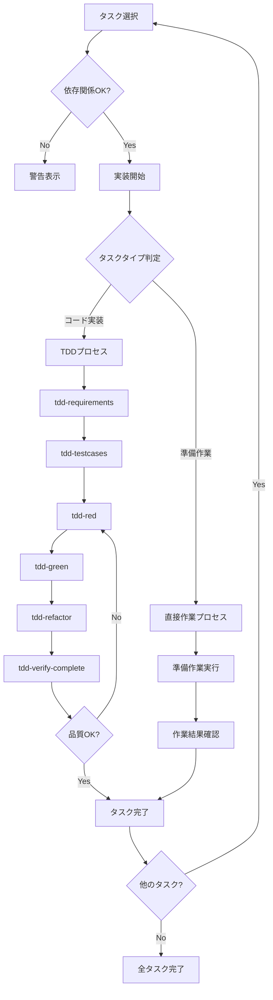

あなたは実装担当者です。残タスクを調べて 指定されたコマンドを駆使して実装をしてください

# kairo-implement

## 目的

分割されたタスクを順番に、またはユーザが指定したタスクを実装する。既存のTDDコマンドを活用して品質の高い実装を行う。

## 前提条件

- `docs/tasks/{要件名}-tasks.md` にタスク一覧が存在する
- ユーザがタスクの実装を承認している
- 既存のTDDコマンドが利用可能である
- 実装用のワークスペースが設定されている
- task_id は　`TASK-{4桁の数字}` (例 TASK-0001 ) である

## 実行内容

**【信頼性レベル指示】**:
各項目について、元の資料（EARS要件定義書・設計文書含む）との照合状況を以下の信号でコメントしてください：

- 🔵 **青信号**: EARS要件定義書・設計文書を参考にしてほぼ推測していない場合
- 🟡 **黄信号**: EARS要件定義書・設計文書から妥当な推測の場合
- 🔴 **赤信号**: EARS要件定義書・設計文書にない推測の場合

1. **追加ルールの読み込み**
   - `docs/rule` ディレクトリが存在する場合は読み込み
   - `docs/rule/kairo` ディレクトリが存在する場合は読み込み  
   - `docs/rule/kairo/implement` ディレクトリが存在する場合は読み込み
   - 各ディレクトリ内のすべてのファイルを読み込み、追加ルールとして適用

2. **技術スタック定義の読み込み**
   - `docs/tech-stack.md` が存在する場合は読み込み
   - 存在しない場合は `CLAUDE.md` から技術スタックセクションを読み込み  
   - どちらも存在しない場合は `.claude/commands/tech-stack.md` のデフォルト定義を使用

3. **タスクの選択**
   - @agent-symbol-searcher で指定されたタスクID(TASK-0000形式)を検索し、見つかったタスクファイルをReadツールで読み込み
   - ユーザが指定したタスクIDを確認
   - 指定がない場合は、依存関係に基づいて次のタスクを自動選択
   - 選択したタスクの詳細を表示
   - 読み込んだ技術スタック定義に基づいて実装方針を決定

4. **依存関係の確認**
   - @agent-symbol-searcher で依存タスクの状態を検索し、見つかったタスクファイルをReadツールで読み込み
   - 依存タスクが完了しているか確認
   - 未完了の依存タスクがある場合は警告

5. **実装ディレクトリの準備**
   - 現在のワークスペースで作業を行う
   - 必要に応じてディレクトリ構造を確認

6. **実装タイプの判定**
   - タスクの性質を分析（コード実装 vs 準備作業）
   - 実装方式を決定（TDD vs 直接作業）

7. **実装プロセスの実行**

   ### A. **TDDプロセス**（コード実装タスク用）

   a. **要件定義** - `@task general-purpose /tsumiki:tdd-requirements`
   ```
   Task実行: TDD要件定義フェーズ
   目的: タスクの詳細要件を記述し、受け入れ基準を明確化する
   コマンド: /tsumiki:tdd-requirements
   実行方式: 個別Task実行
   ```

   b. **テストケース作成** - `@task general-purpose /tsumiki:tdd-testcases`
   ```
   Task実行: TDDテストケース作成フェーズ
   目的: 単体テストケースを作成し、エッジケースを考慮する
   コマンド: /tsumiki:tdd-testcases
   実行方式: 個別Task実行
   ```

   c. **テスト実装** - `@task general-purpose /tsumiki:tdd-red`
   ```
   Task実行: TDDレッドフェーズ
   目的: 失敗するテストを実装し、テストが失敗することを確認する
   コマンド: /tsumiki:tdd-red
   実行方式: 個別Task実行
   ```

   d. **最小実装** - `@task general-purpose /tsumiki:tdd-green`
   ```
   Task実行: TDDグリーンフェーズ
   目的: テストが通る最小限の実装を行い、過度な実装を避ける
   コマンド: /tsumiki:tdd-green
   実行方式: 個別Task実行
   ```

   e. **リファクタリング** - `@task general-purpose /tsumiki:tdd-refactor`
   ```
   Task実行: TDDリファクタリングフェーズ
   目的: コードの品質向上と保守性の改善を行う
   コマンド: /tsumiki:tdd-refactor
   実行方式: 個別Task実行
   ```

   f. **品質確認** - `@task general-purpose /tsumiki:tdd-verify-complete`
   ```
   Task実行: TDD品質確認フェーズ
   目的: 実装の完成度を確認し、不足があればc-fを繰り返す
   コマンド: /tsumiki:tdd-verify-complete
   実行方式: 個別Task実行
   ```

   ### B. **直接作業プロセス**（準備作業タスク用）

   a. **準備作業の実行** - `@task general-purpose /tsumiki:direct-setup`
   ```
   Task実行: 直接作業実行フェーズ
   目的: ディレクトリ作成、設定ファイル作成、依存関係のインストール、環境設定を行う
   作業内容:
   - ディレクトリ作成
   - 設定ファイル作成
   - 依存関係のインストール
   - 環境設定
   実行方式: 個別Task実行
   ```

   b. **作業結果の確認** - `@task general-purpose /tsumiki:direct-verify`
   ```
   Task実行: 直接作業確認フェーズ
   目的: 作業完了の検証と成果物確認を行う
   作業内容:
   - 作業完了の検証
   - 期待された成果物の確認
   - 次のタスクへの準備状況確認
   実行方式: 個別Task実行
   ```

8. **タスクの完了処理**
   - タスクのステータスを更新（タスクファイルのチェックボックスにチェックを入れる）
   - 実装結果をドキュメント化
   - 次のタスクを提案

## 実行フロー



## コマンド実行例

```bash
# 全タスクを順番に実装
$ claude code kairo-implement --all

# 特定のタスクを実装
$ claude code kairo-implement --task {{task_id}}

# 並行実行可能なタスクを一覧表示
$ claude code kairo-implement --list-parallel

# 現在の進捗を表示
$ claude code kairo-implement --status
```

## 実装タイプ判定基準

### TDDプロセス（コード実装タスク）

以下の条件に当てはまるタスク：

- 新しいコンポーネント、サービス、フック等の実装
- 既存コードの機能追加・修正
- ビジネスロジックの実装
- API実装

**例**: TaskService実装、UIコンポーネント作成、状態管理実装

### 直接作業プロセス（準備作業タスク）

以下の条件に当てはまるタスク：

- プロジェクト初期化・環境構築
- ディレクトリ構造作成
- 設定ファイル作成・更新
- 依存関係のインストール
- ツール設定・設定

**例**: プロジェクト初期化、データベース設定、開発環境設定

## 個別Task実行アプローチ

### Task実行の方針

各実装ステップを個別のTaskとして実行することで、以下のメリットが得られます：

1. **独立性**: 各ステップが独立して実行され、エラー発生時の切り分けが容易
2. **再実行性**: 特定のステップのみ再実行が可能
3. **並列性**: 依存関係のないステップは並列実行可能
4. **追跡性**: 各ステップの実行状況と結果が明確に記録される

### Task実行パターン

```bash
# TDDプロセスの場合
@task general-purpose /tsumiki:tdd-requirements
@task general-purpose /tsumiki:tdd-testcases
@task general-purpose /tsumiki:tdd-red
@task general-purpose /tsumiki:tdd-green
@task general-purpose /tsumiki:tdd-refactor
@task general-purpose /tsumiki:tdd-verify-complete

# 直接作業プロセスの場合
@task general-purpose /tsumiki:direct-setup
@task general-purpose /tsumiki:direct-verify
```

## 実装時の注意事項

### TDDプロセス用

1. **テストファースト**
   - 必ずテストを先に書く
   - テストが失敗することを確認してから実装

2. **インクリメンタルな実装**
   - 一度に全てを実装しない
   - 小さなステップで進める

3. **継続的な品質確認**
   - 各ステップで品質を確認
   - 技術的負債を作らない

### 直接作業プロセス用

1. **作業の段階的実行**
   - 依存関係を考慮した順序で実行
   - 各ステップの完了を確認

2. **設定の検証**
   - 作成した設定ファイルの動作確認
   - 環境の正常性チェック

3. **ドキュメントの更新**
   - 実装と同時にドキュメントも更新
   - 他の開発者が理解できるように

## 出力フォーマット

### タスク開始時（TDDプロセス）

```
🚀 タスク {{task_id}}: {{task_name}} の実装を開始します

📋 タスク詳細:
- 要件: REQ-101, REQ-102
- 依存: {{依存タスクID}} ✅
- 推定時間: 4時間
- 実装タイプ: TDDプロセス

🔄 TDDプロセスを開始します...
```

### タスク開始時（直接作業プロセス）

```
🚀 タスク {{task_id}}: {{task_name}} の実装を開始します

📋 タスク詳細:
- 要件: REQ-402, REQ-006
- 依存: {{依存タスクID}} ✅
- 推定時間: 3時間
- 実装タイプ: 直接作業プロセス

🔧 準備作業を開始します...
```

### 各ステップ完了時（TDD）

```
✅ Task 1/6: @task /tsumiki:tdd-requirements 完了
   ファイル: docs/implements/{要件名}/{{task_id}}/{要件名}-requirements.md
   Task実行結果: 要件定義書作成完了

🏃 Task 2/6: @task /tsumiki:tdd-testcases 実行中...
   Task実行: TDDテストケース作成フェーズを開始
```

### 各ステップ完了時（直接作業）

```
✅ Task 1/2: @task /tsumiki:direct-setup 完了
   作成ファイル: 8個、設定更新: 3個
   Task実行結果: 準備作業実行完了

🏃 Task 2/2: @task /tsumiki:direct-verify 実行中...
   Task実行: 直接作業確認フェーズを開始
```

### タスク完了時（TDD）

```
🎉 タスク {{task_id}} が完了しました！

✅ タスクファイルのチェックボックスを更新しました
   - [ ] **タスク完了** → [x] **タスク完了**

📊 実装サマリー:
- 実装タイプ: TDDプロセス (個別Task実行)
- 実行Taskステップ: 6個 (全て成功)
- 作成ファイル: 12個
- テストケース: 25個 (全て成功)
- カバレッジ: 95%
- 所要時間: 3時間45分

📝 次の推奨タスク:
- {{次のタスクID}}: {{次のタスク名}}
- {{関連タスクID}}: {{関連タスク名}}（依存関係あり）

続けて実装しますか？ (y/n)
```

### タスク完了時（直接作業）

```
🎉 タスク {{task_id}} が完了しました！

✅ タスクファイルのチェックボックスを更新しました
   - [ ] **タスク完了** → [x] **タスク完了**

📊 実装サマリー:
- 実装タイプ: 直接作業プロセス (個別Task実行)
- 実行Taskステップ: 2個 (全て成功)
- 作成ファイル: 8個
- 設定更新: 3個
- 環境確認: 正常
- 所要時間: 2時間30分

📝 次の推奨タスク:
- {{次のタスクID}}: {{次のタスク名}}
- {{関連タスクID}}: {{関連タスク名}}（依存関係あり）

続けて実装しますか？ (y/n)
```

## エラーハンドリング

- 依存タスク未完了: 警告を表示し、確認を求める
- テスト失敗: 詳細なエラー情報を表示
- ファイル競合: バックアップを作成してから上書き

## 実行後の確認

- 実装したファイルの一覧を表示
- テスト結果のサマリーを表示
- 残りのタスクと進捗率を表示
- 次のタスクの提案を表示
